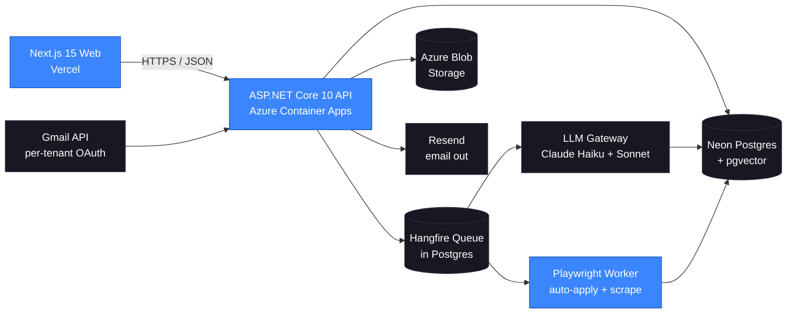

<div align="center">

# Aireq

**The AI Operations Copilot for staffing agencies and consultants.**

*Pronounced "AI-rek" — AI + req(uisition).*

[](https://github.com/mshanawaz114/aireq/actions/workflows/ci.yml)
[](https://github.com/mshanawaz114/aireq/actions/workflows/security.yml)
[](https://github.com/mshanawaz114/aireq/actions/workflows/accessibility.yml)
[](LICENSE)
[](https://www.conventionalcommits.org/)
[](ACCESSIBILITY.md)
[](https://dotnet.microsoft.com/)
[](https://nextjs.org/)

</div>

---

## What is Aireq?

Aireq is an **AI Operations Copilot** that automates outbound consultant marketing end-to-end. Upload one resume; Aireq continuously discovers real openings across multiple sources, rewrites the resume per role to clear ATS filters at ≥75% match, auto-submits via portal APIs and Playwright, sends personalized follow-ups, and only pings a human when a recruiter actually replies.

It is built for two audiences:

1. **Independent consultants** drowning in 100+ job boards and ghost applications.
2. **Staffing agencies** doing the same work manually for a roster of consultants.

Aireq is **not** another job aggregator and **not** an ATS for HR teams. It sits on the **supply side** of the staffing market — turning one consultant's profile into hundreds of high-quality, AI-tailored applications without the operational overhead.

---

## Why this exists

The staffing market is operationally broken:

- Aggregators (Indeed, Dice, ZipRecruiter, LinkedIn) surface stale and duplicate postings.
- ATS filters reject ~75% of resumes on keyword mismatch alone.
- Recruiters operate in a black hole — most candidates wait 2+ weeks for any response.
- Consultants and small agencies spend 60-80% of their day on submissions and follow-ups instead of relationships and billable work.

Aireq automates the operational layer so humans can focus on the human parts — interviews, negotiation, relationships.

---

## Architecture (high-level)



See [`docs/ARCHITECTURE.md`](docs/ARCHITECTURE.md) for the deep dive and [`docs/adr/`](docs/adr/) for the decision records.

---

## Tech stack

| Layer | Choice |
|---|---|
| Backend | **.NET 10 LTS** (C# 13) · ASP.NET Core Minimal API · EF Core 10 |
| Background jobs | **Hangfire** with Postgres storage |
| Browser automation | **Microsoft Playwright** (.NET binding) |
| LLM | **Anthropic Claude** (Haiku 4.5 + Sonnet 4.6) via internal `LlmGateway` |
| Database | **Neon Postgres** (serverless) + `pgvector` for embeddings |
| Web | **Next.js 15** (App Router) · Tailwind · shadcn/ui |
| Auth | ASP.NET Identity + JWT |
| Email | **Resend** (outbound) · Gmail API (inbound) |
| Storage | Azure Blob Storage |
| Hosting | Azure Container Apps + Vercel Hobby |
| CI/CD | GitHub Actions |
| Observability | Serilog → Azure Monitor; Sentry for errors |
| Security | gitleaks · CodeQL · Dependabot · push protection · secret scanning |
| Accessibility | axe-core · pa11y-ci · lighthouse-ci |

Full matrix with rationale and cost: [`PLAN.md` → Tooling matrix](PLAN.md#tooling-matrix).

---

## Quickstart (developer)

> **Prerequisites:** .NET 10 SDK, Node 22 LTS, pnpm 9, Docker (for Postgres + Azurite locally), GitHub CLI.

```bash
# 1. Clone
git clone git@github.com:mshanawaz114/aireq.git && cd aireq

# 2. Bootstrap (idempotent)
./scripts/bootstrap.sh     # installs deps, runs migrations against local Postgres

# 3. Run all three apps with hot reload
make dev                   # equivalent to: api + worker + web in three panes

# 4. Open
open http://localhost:3000
```

The first end-to-end story (`AIRMVP1-101`) scaffolds the actual code — until then, the repo is documentation + governance + prototype.

The clickable UI prototype lives at [`prototype.html`](prototype.html) — open it directly in any browser.

---

## Repo layout

```
aireq/
├── apps/                  (created in AIRMVP1-101)
│   ├── api/               ASP.NET Core 10 minimal API
│   ├── worker/            Hangfire + Playwright host
│   └── web/               Next.js 15
├── packages/
│   └── shared/            shared types / contracts
├── infra/
│   ├── bicep/             Azure resources
│   └── github/            reusable workflows
├── docs/
│   ├── ARCHITECTURE.md
│   ├── RUNBOOK.md
│   └── adr/               Architecture Decision Records
├── skills/
│   └── aireq-context/     Claude/Cowork skill — loads project memory
├── plugins/
│   └── aireq-dev/         Plugin manifest grouping skills + commands
├── scripts/               (created in AIR0002) bootstrap, lint, deploy helpers
├── .github/               workflows, issue/PR templates, CODEOWNERS, dependabot
├── memory.md              ⭐ persistent project context — READ FIRST
├── PLAN.md                phases, epics, stories with IDs
├── REPO_INIT.md           one-time scaffold script (Day 0)
├── AGENTS.md              operating manual for AI agents
├── CONTRIBUTING.md
├── CODE_OF_CONDUCT.md
├── SECURITY.md
├── ACCESSIBILITY.md
├── prototype.html         clickable UI mock
└── README.md              (this file)
```

---

## Project conventions (critical)

### Branch naming

| Prefix | Use for | Example |
|---|---|---|
| `AIR####-<slug>` | Foundation / cross-cutting work | `AIR0001-initial-workflow` |
| `AIRMVP{N}-<story>-<slug>` | MVP iteration N stories | `AIRMVP1-103-tenant-middleware` |
| `AIRGA1-<story>-<slug>` | Phase 2 (GA hardening) | `AIRGA1-140-axe-cert` |
| `hotfix/<short-desc>` | Production hotfixes | `hotfix/jwt-clock-skew` |
| `release/v<X.Y.Z>` | Release-prep branches | `release/v0.1.0` |

### Commit format ([Conventional Commits](https://www.conventionalcommits.org/))

```
<type>(<scope>): <subject>

<body explaining what and why>

Refs: <story-id>
```

`<type>`: `feat | fix | chore | docs | test | refactor | perf | build | ci | style | security`.
`<scope>`: `api | worker | web | infra | docs`.
Every commit references its story ID in the footer.

### Pull requests — push and PR are **one command**

We never push without immediately opening a PR. The repo ships [`scripts/push-pr.sh`](scripts/push-pr.sh) for this. From any feature branch:

```bash
./scripts/push-pr.sh
# or, with an explicit title:
./scripts/push-pr.sh "AIRMVP1-103 tenant middleware"
```

Requirements:
- Title format: `<story-id> <short title>` — e.g. `AIRMVP1-103 tenant middleware`.
- CI green (build, lint, format, gitleaks, CodeQL, axe-core, tests).
- ≥ 1 CODEOWNER approval.
- `memory.md` updated if a decision was made.

---

## Accessibility

Aireq targets **WCAG 2.2 Level AA** and aligns with **ADA Title III** and **Section 508**. axe-core and pa11y-ci run on every pull request. See [`ACCESSIBILITY.md`](ACCESSIBILITY.md) for the full commitment and accommodation contact.

---

## Security

**No secrets are ever committed to this repo.** Push protection, secret scanning, gitleaks pre-commit, CodeQL, and Dependabot all run continuously. To report a vulnerability, see [`SECURITY.md`](SECURITY.md).

---

## Project status

| Phase | Status |
|---|---|
| Phase 0 — Foundations | **in progress** (`AIR0001-initial-workflow` branch) |
| Phase 1 — MVP v1 (Weeks 1-4) | pending |
| Phase 2 — Multi-user GA (Weeks 5-8) | pending |
| Phase 3 — Scale & moat | pending |

Detailed plan with epics, stories, gates, and estimates: [`PLAN.md`](PLAN.md).

---

## For AI agents working in this repo

Read [`AGENTS.md`](AGENTS.md) first. It documents how Claude, ChatGPT, Cursor, Copilot or any other coding agent must behave inside this repo (memory.md first, branch + commit conventions, no secret leakage, accessibility-first PRs).

---

## License

MIT — see [`LICENSE`](LICENSE).

© 2026 Shahnawaz Mohammed.
